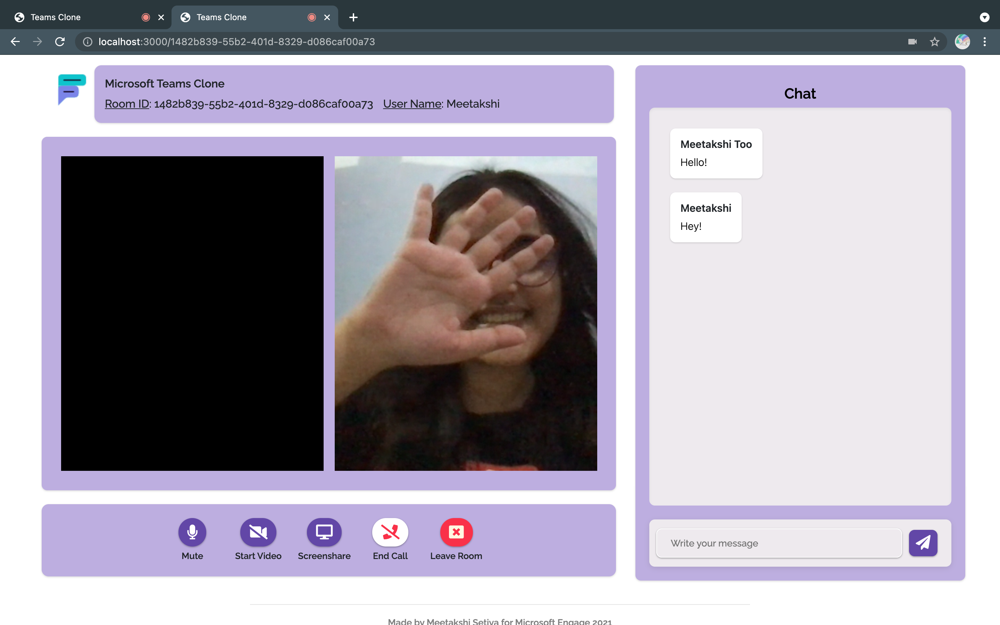
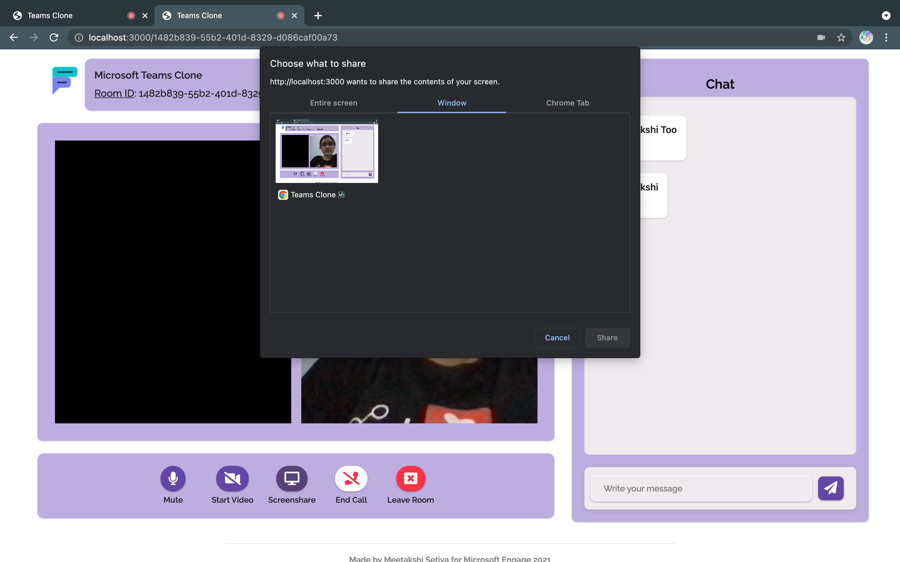
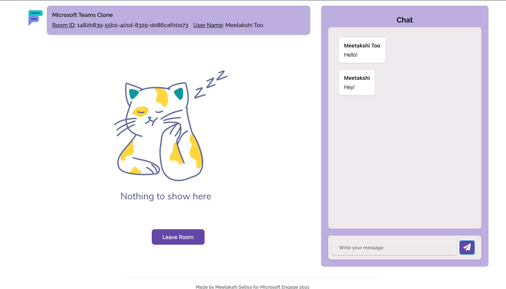

# Microsoft Teams Clone

[Teams Clone]('https://github.com/meetakshi253/teams-clone') is a web app for facilitating video calls and in-call text chatting, developed for the Microsoft Engage Mentorship Program 2021.
> **Note:** The app works best for two peers only.

<br />

## Features

* **Mandatory**: Two-person video call.

* **Surprise**: Chat with and without video call.

* **Additional**:
  * Nickname for the meeting
  * Rooms
  * Custom-named Rooms
  * Mute/Unmute Microphone
  * Play/Stop Video
  * Share Screen
  * End Call
  * Leave Meeting
  * Consistent UI

<br />

## Technologies used

* **Client:** EJS, CSS, Vanilla JavaScript

* **Server:** Node, Express

* **Video Call and Chat:** Socket.io, WebRTC, PeerJS 

<br />

## Run Locally

Clone the project

```bash
  git clone https://github.com/meetakshi253/teams-clone.git
```

Go to the project directory

```bash
  cd teams-clone
```

Install dependencies

```bash
  npm install
```

Start the server and client on separate terminals

```bash
  npm run devStart
  peerjs --port 5000
```

Or start them concurrently

```bash
  npm run start
```

Go to [http://localhost:3000/](http://localhost:3000/) on your browser (preferrably, Google Chrome)

<br />

## Screenshots

<br/>







<br />

## Resourses

* [Icons by Font Awesome](https://fontawesome.com)
* [Raleway by Google Fonts](https://fonts.google.com/specimen/Raleway)
* [How to write a Good readme](https://bulldogjob.com/news/449-how-to-write-a-good-readme-for-your-github-project)

<br/>

## Contact

* [Github: meetakshi253](https://github.com/meetakshi253)
* [LinkedIn: meetakshisetiya](https://www.linkedin.com/in/meetakshisetiya/)
